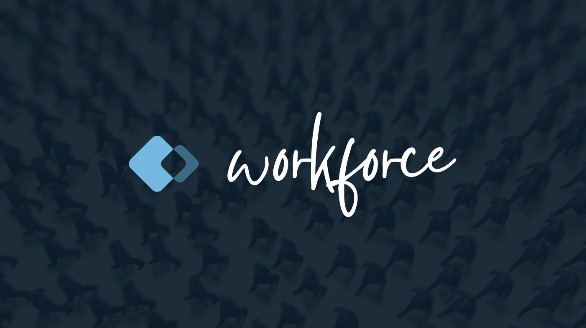

<center>Deployable AI agent personas, versioned and shared like code.</center>
<br />

A deployable agent is a **persona** plus an **agent** (`agent.ts`). The persona —
a JSON file or a typed `persona.ts` source module — names the harness, model,
skills, permissions, integration connections, sandbox policy, and memory. The
agent declares the triggers, schedules, and watch rules that fire it, plus the
handler. Together they run locally or in the cloud-facing runtime.

```bash
workforce deploy ./review-agent.json
```

The deploy flow validates the persona, connects declared integrations, bundles
the handler, and starts the runner. The full v1 plan is in
[`docs/plans/deploy-v1.md`](./docs/plans/deploy-v1.md).

## Quick start

Deploy the weekly digest example:

```bash
workforce deploy ./examples/weekly-digest/persona.json
```

Typed personas can be deployed directly, or compiled first when you need a
portable JSON artifact:

```bash
agentworkforce deploy ./examples/review-agent/persona.ts --mode dev --dry-run
agentworkforce persona compile ./examples/review-agent/persona.ts
```

Run the same persona in a Daytona sandbox with either workforce-managed auth:

```bash
workforce login
workforce deploy ./examples/weekly-digest/persona.json --sandbox
```

Or bring your own Daytona key:

```bash
export DAYTONA_API_KEY=...
workforce deploy ./examples/weekly-digest/persona.json --sandbox --byo-sandbox
```

For local iteration, run it in dev mode:

```bash
BRAVE_API_KEY=... workforce deploy ./examples/weekly-digest/persona.json --dev
```

The example searches Brave on a weekly cron schedule, clusters findings, and
upserts a GitHub issue. See
[`examples/weekly-digest`](./examples/weekly-digest/).

## Persona vs agent

A deployable agent is two files. The **persona** says *what the agent is*
(identity, runtime, skills, MCP, and which providers it **connects** to). The
**agent** (`agent.ts`) says *when and how it fires* (triggers, schedules, watch
rules) and *what it does* (the handler) — authored with `defineAgent`.

`persona.json` (connection config only — no triggers):

```json
{
  "id": "review-agent",
  "intent": "review",
  "tags": ["review"],
  "description": "Reviews opened PRs, responds to @mentions, and comments on red CI.",
  "cloud": true,
  "useSubscription": true,
  "integrations": {
    "github": {},
    "slack": {}
  },
  "sandbox": true,
  "memory": { "enabled": true, "scopes": ["session", "workspace"] },
  "onEvent": "./agent.ts",
  "harness": "codex",
  "model": "gpt-5.4",
  "systemPrompt": "Review PRs for correctness, risk, and missing tests.",
  "harnessSettings": { "reasoning": "medium", "timeoutSeconds": 1200 }
}
```

`agent.ts` (triggers/schedules/watch + handler):

```ts
import { defineAgent } from '@agentworkforce/runtime';

export default defineAgent({
  triggers: {
    github: [
      { on: 'pull_request.opened' },
      { on: 'issue_comment.created', match: '@mention' },
    ],
    slack: [{ on: 'message.created', match: '@mention' }],
  },
  // schedules: [{ name: 'nightly', cron: '0 2 * * *' }],
  handler: async (ctx, event) => {
    // `event.type` narrows to the declared triggers.
  },
});
```

Every provider an agent triggers on must also appear in `persona.integrations`
(so the connection is set up). The handler decides what to do when a cron tick,
GitHub event, Linear issue, Slack mention, Notion update, or Jira event arrives.
See [`examples/review-agent`](./examples/review-agent/) for a complete example.

## Run modes

`workforce deploy <persona-path>` defaults to the best available runner mode.

| Mode | Use it for |
| --- | --- |
| `--dev` | Local long-lived iteration. The bundled runner executes on your machine and streams logs. |
| `--sandbox` | Daytona-backed execution with the bundle uploaded into a sandbox. |
| `--cloud` | Reserved for the hosted deploy endpoint. The flag exists, but hosted deploy lands after the v1 local/sandbox slice. |

You can also use `--bundle-out <dir>` to stage the bundle without launching it,
or `--dry-run` to validate schema, triggers, and integration readiness.

## Integrations supported

Deploy v1 targets the Tier-1 Relayfile providers:

| Provider | Typical triggers |
| --- | --- |
| GitHub | `pull_request.opened`, `issue_comment.created`, `check_run.completed` |
| Linear | `issue.created`, `issue.updated`, `comment.created` |
| Slack | `message.created`, `message.updated`, reactions |
| Notion | page, database, block, and comment updates |
| Jira | issue, comment, project, and sprint updates |

Persona-kit ships a trigger registry for linting. Unknown trigger names warn
instead of failing deploy, because the cloud runtime remains the source of
truth.

## Local agents

Personas still work as local harness configs. A local persona chooses the coding
agent, model, reasoning settings, skills, MCP servers, sidecar prompts,
permissions, and file visibility rules for an interactive session.

Install a first-party persona pack, then run one of its personas:

```bash
npx agentworkforce install @agentworkforce/personas-core
npx agentworkforce agent frontend-implementer
```

Create a project-specific persona:

```bash
npx agentworkforce create
```

This opens the internal `persona-maker` system persona. By default, new personas
are saved to `./.agentworkforce/workforce/personas`.

Common local commands:

```text
agentworkforce create [--save-in-directory=<target>] [--save-default]
agentworkforce agent [--install-in-repo] <persona>[@<tier>]
agentworkforce list [flags]
agentworkforce install [flags] <pkg|path>
agentworkforce sources <list|add|remove>
agentworkforce harness check
agentworkforce --version
```

Local personas resolve from project-local files, configured source directories,
the personal persona directory, and the small built-in catalog. Higher layers
override lower layers field by field, so a repo can extend a reusable pack
persona with local conventions.

## Personas as packages

Reusable personas are distributed through npm packages. Install a pack into the
current project:

```bash
agentworkforce install @agentworkforce/personas-core
agentworkforce install @agentworkforce/personas-core@0.8.0 --persona code-reviewer
agentworkforce install ./local-personas --persona code-reviewer
```

The command copies matching `*.json` persona files into
`./.agentworkforce/workforce/personas/`. Existing files are skipped by default;
pass `--overwrite` to replace them.

Package layout:

```text
@acme/personas/
├── package.json
└── personas/
    ├── reviewer.json
    └── release-runner.json
```

```json
{
  "name": "@acme/personas",
  "version": "1.0.0",
  "files": ["personas"],
  "keywords": ["agentworkforce-personas"],
  "agentworkforce": {
    "personas": "personas"
  }
}
```

First-party packages:

- `@agentworkforce/personas-core` is owned in this repo and contains generic
  personas such as `code-reviewer`, `frontend-implementer`, `verifier`, and
  `test-strategist`.
- `@agentrelay/personas` is owned by the Relay repo and contains
  Relay-specific personas such as `relay-orchestrator`.

The full local CLI docs, cascade rules, MCP transport options, permission
grammar, skill staging, and sandbox mount behavior live in
[`packages/cli/README.md`](./packages/cli/README.md).

## Packages

- `packages/persona-kit` — composable primitives for parsing personas,
  translating MCP/permission config, staging skills, and linting deploy
  triggers.
- `packages/workload-router` — TypeScript SDK for typed persona and routing
  profile resolution.
- `packages/cli` — command-line implementation used by the `agentworkforce`
  wrapper.
- `packages/runtime` — deploy runtime facade and per-integration clients.
- `packages/deploy` — bundle staging and runner launch modes for `workforce
  deploy`.

## TypeScript SDK usage

For internal system personas, use `usePersona(intent)` to resolve a persona and
pre-compute install metadata. It is synchronous and side-effect free.

```ts
import { usePersona } from '@agentworkforce/workload-router';
import { spawnSync } from 'node:child_process';

const { selection, install } = usePersona('persona-authoring');

spawnSync(install.commandString, { shell: true, stdio: 'inherit' });
console.log(selection.personaId, selection.tier);
```

For lower-level primitives, see
[`packages/workload-router/README.md`](./packages/workload-router/README.md).
